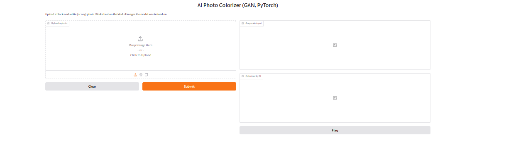
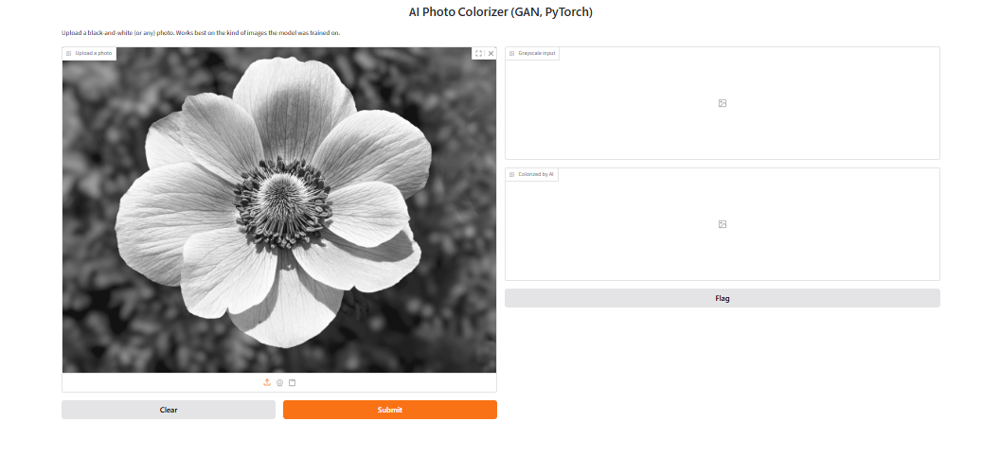
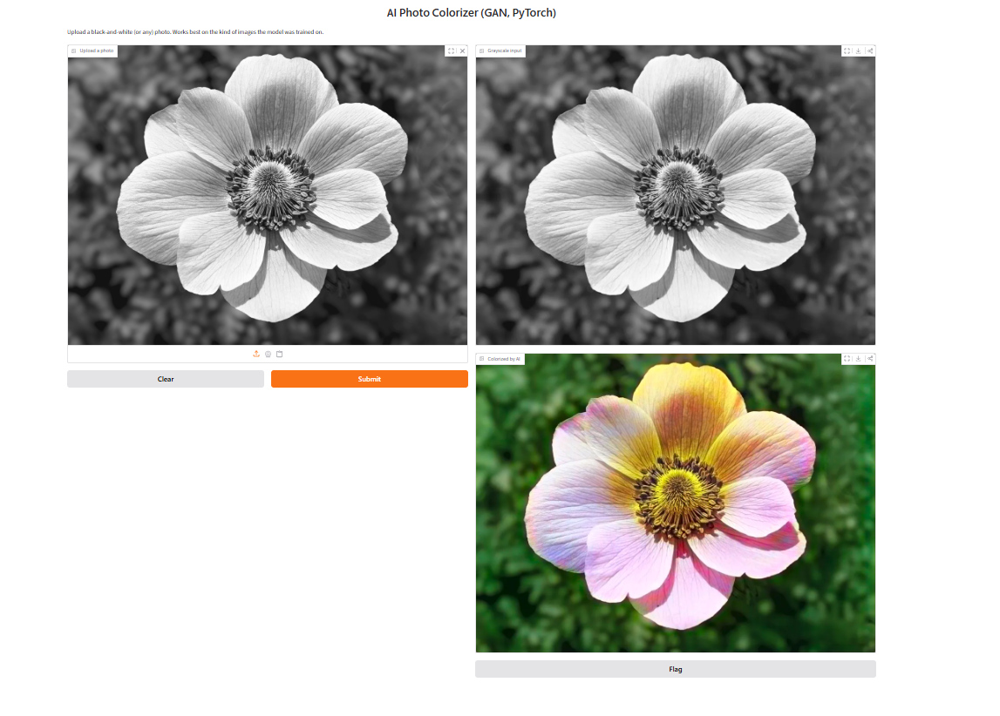
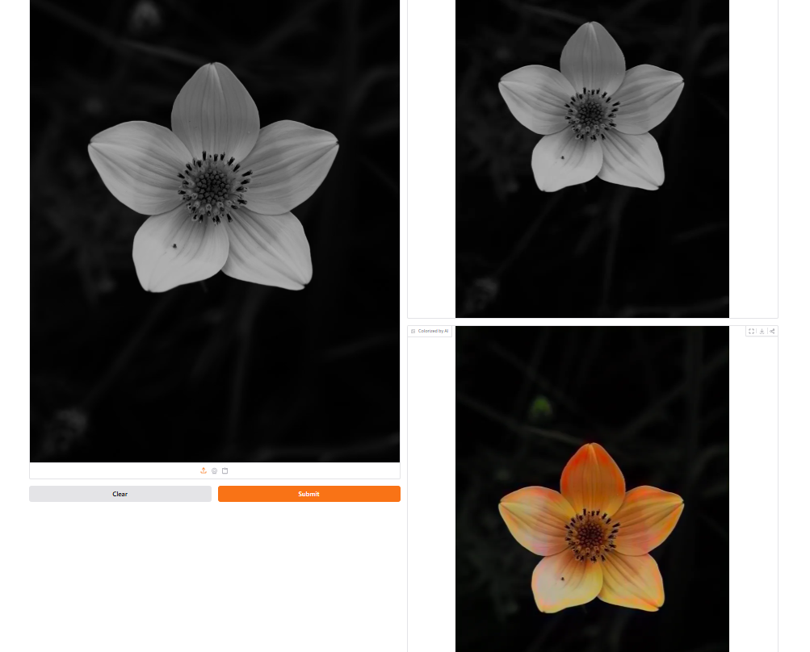
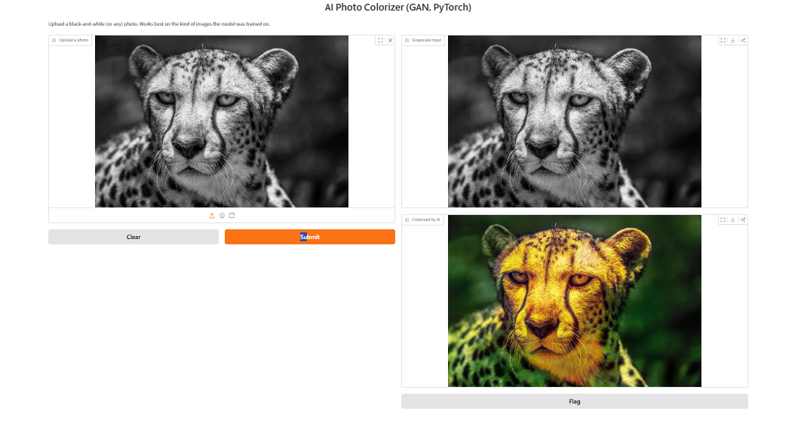

# AI Photo Colorizer (GAN, PyTorch)

Turns black-and-white photos into color. A conditional GAN (U-Net generator + PatchGAN
discriminator) works in **LAB color space**: it sees the lightness channel **L** (the
grayscale photo) and predicts the two color channels **a, b**.

No paired dataset needed: every color photo supplies both the input (its L) and the answer (its ab).

## Run on Google Colab (free GPU)
Runtime > Change runtime type > T4 GPU. Upload this folder, then:

```bash
%cd colorizer
!pip install -q gradio opencv-python

# 0) quick checks (no training)
!python colorspace.py
!python models.py

# 1) data: ~8,000 flower photos (or use any folder of color photos)
!python download_data.py --out data/flowers

# 2) test run first (1 epoch), then the real run (~1 hour, estimate)
!python train.py --data data/flowers --max_items 500 --epochs 1
!python train.py --data data/flowers --max_items 4000 --epochs 20

# 3) demo
!python app.py --weights outputs/generator.pth --share
```
Download `outputs/generator.pth` before the session ends.

## Outputs for your report
- `outputs/epoch_XXX.png`: rows of [grayscale | AI color | original], compare epoch 1 vs last
- `outputs/loss_curve.png`: GAN losses and validation color error

## Report outline
1. Problem: colorization is ambiguous (many valid colors for one gray photo)
2. Data and LAB color space; why predict ab from L
3. Architecture: U-Net generator, PatchGAN discriminator; losses (adversarial + 100 x L1)
4. Training setup (epochs, batch, lr, hardware)
5. Results: epoch grids, loss curves, validation color error; try old B/W photos too
6. Limitations: trained on flowers, so other scenes look muted or wrong; colors are plausible,
   not guaranteed correct (e.g. a car may come out any color)
7. Future work: larger and more varied dataset, perceptual loss, diffusion-based colorization

## Files
| File | Purpose |
|---|---|
| colorspace.py | RGB <-> LAB helpers (`python colorspace.py` self-test) |
| models.py | U-Net generator, PatchGAN discriminator |
| dataset.py | Loads photos, makes (L, ab) pairs, augmentation, train/val split |
| download_data.py | Downloads Oxford Flowers-102 |
| train.py | GAN training loop, validation, sample grids, loss curves |
| app.py | Gradio demo: upload photo -> colorized result |

## Results






